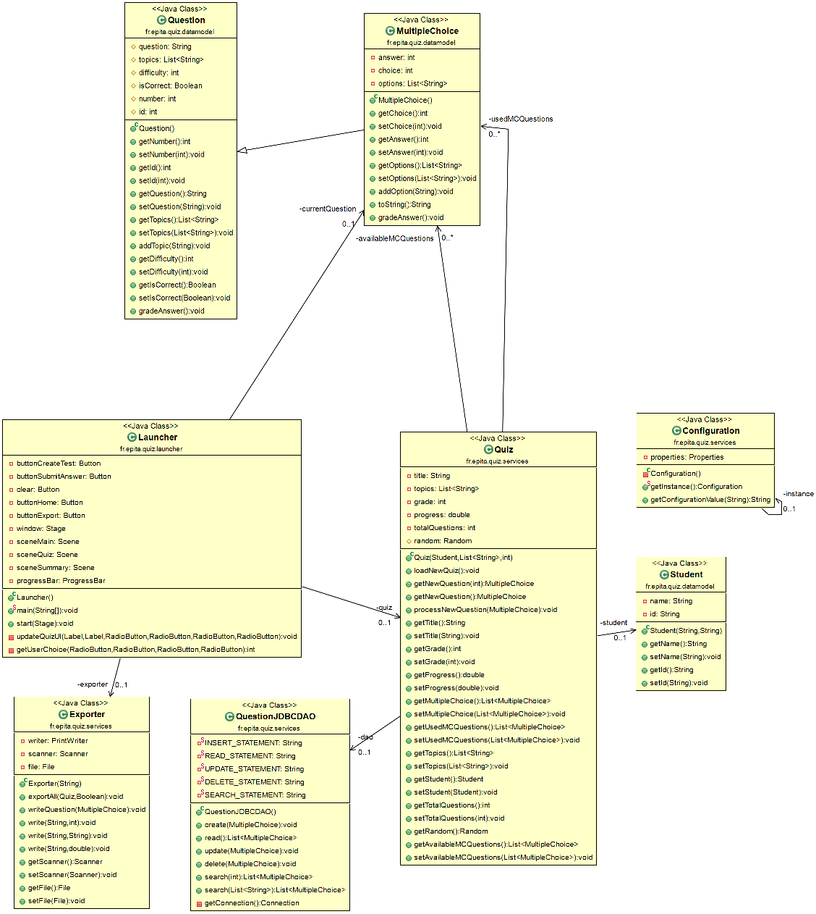

# QuizManager
Course Project for Java class at EPITA's Master's Program

## Class Diagram



## Getting Started
PLACEHOLDER 

## Create Table
```
create table BANK(
	id bigint auto_increment, 
	QUESTION varchar(255), 
	DIFFICULTY INT,
	TOPICS ARRAY,
	OP_1 varchar(255), 
	OP_2 varchar(255), 
	OP_3 varchar(255), 
	OP_4 varchar(255), 
	ANSWER INT
);
```