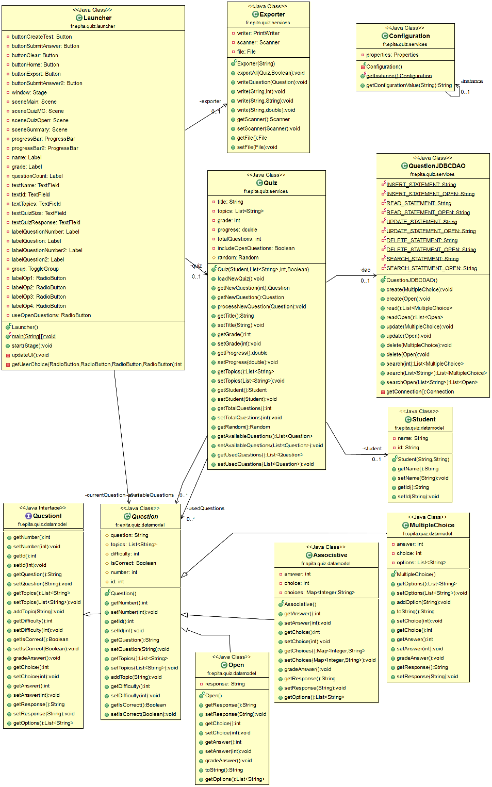

# QuizManager
Course Project for Java class at EPITA's Master's Program

### Getting Started
To run this application, you'll need to have H2 service up and running.

After the H2 service is running, run the `QuizManagerApplication.jar` to 
start the application.

The scripts below are for creating the H2 tables, if needed.

### Create Tables
```
create table MCQ(
	id bigint auto_increment, 
	QUESTION varchar(255), 
	DIFFICULTY INT,
	TOPICS ARRAY,
	OP_1 varchar(255), 
	OP_2 varchar(255), 
	OP_3 varchar(255), 
	OP_4 varchar(255), 
	ANSWER INT
);

create table OQ(
	id bigint auto_increment, 
	QUESTION varchar(255), 
	DIFFICULTY INT,
	TOPICS ARRAY,
	ANSWER varchar(255)
);
```

### Class Diagram

